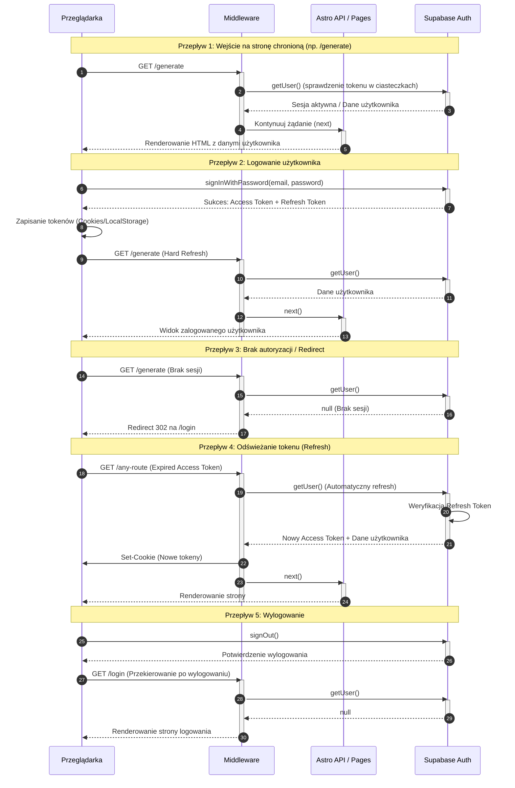

# Architektura Autentykacji - Diagram Sekwencji

Ten dokument przedstawia przepływ autentykacji w aplikacji przy użyciu Astro, React i Supabase Auth.

```mermaid
sequenceDiagram
    autonumber
    participant B as Przeglądarka
    participant M as Middleware
    participant A as Astro API / Pages
    participant S as Supabase Auth

    Note over B,S: Przepływ 1: Wejście na stronę chronioną (np. /generate)

    B->>M: GET /generate
    activate M
    M->>S: getUser() (sprawdzenie tokenu w ciasteczkach)
    activate S
    S-->>M: Sesja aktywna / Dane użytkownika
    deactivate S
    M->>A: Kontynuuj żądanie (next)
    activate A
    A-->>B: Renderowanie HTML z danymi użytkownika
    deactivate A
    deactivate M

    Note over B,S: Przepływ 2: Logowanie użytkownika

    B->>S: signInWithPassword(email, password)
    activate S
    S-->>B: Sukces: Access Token + Refresh Token
    deactivate S
    B->>B: Zapisanie tokenów (Cookies/LocalStorage)
    B->>M: GET /generate (Hard Refresh)
    activate M
    M->>S: getUser()
    activate S
    S-->>M: Dane użytkownika
    deactivate S
    M->>A: next()
    activate A
    A-->>B: Widok zalogowanego użytkownika
    deactivate A
    deactivate M

    Note over B,S: Przepływ 3: Brak autoryzacji / Redirect

    B->>M: GET /generate (Brak sesji)
    activate M
    M->>S: getUser()
    activate S
    S-->>M: null (Brak sesji)
    deactivate S
    M-->>B: Redirect 302 na /login
    deactivate M

    Note over B,S: Przepływ 4: Odświeżanie tokenu (Refresh)

    B->>M: GET /any-route (Expired Access Token)
    activate M
    M->>S: getUser() (Automatyczny refresh)
    activate S
    S->>S: Weryfikacja Refresh Token
    S-->>M: Nowy Access Token + Dane użytkownika
    deactivate S
    M->>B: Set-Cookie (Nowe tokeny)
    M->>A: next()
    activate A
    A-->>B: Renderowanie strony
    deactivate A
    deactivate M

    Note over B,S: Przepływ 5: Wylogowanie

    B->>S: signOut()
    activate S
    S-->>B: Potwierdzenie wylogowania
    deactivate S
    B->>M: GET /login (Przekierowanie po wylogowaniu)
    activate M
    M->>S: getUser()
    activate S
    S-->>M: null
    deactivate S
    M-->>B: Renderowanie strony logowania
    deactivate M
```
